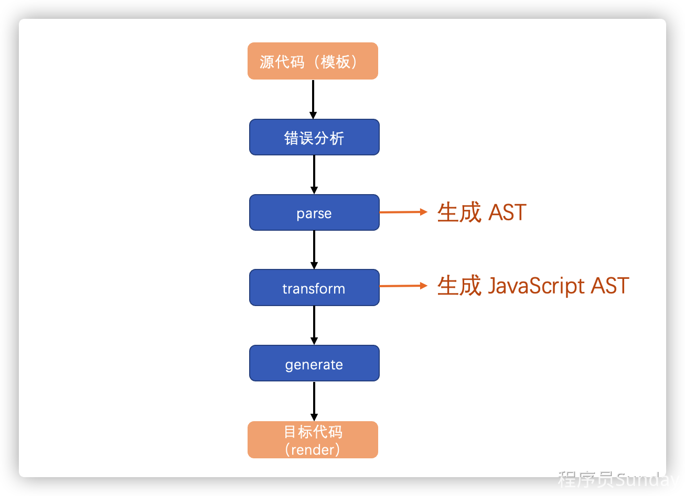

### 01：前言


从这一章开始我们就开始进入到编译器的学习。


编译器是一个非常复杂的概念，在很多语言中均有涉及。不同类型的编译器在实现技术上都会有较大的差异。

比如你要实现一个  `java` 或者 `JavaScript` 的编译器，那就是一个非常复杂的过程了。

但是对于我们而言，我们并不需要设计这种复杂的语言编辑器，我们只需要有一个 [领域特定语言（DSL）](https://baike.baidu.com/item/领域专用语言/61027566?fromtitle=DSL&fromid=60963557) 的编辑器即可。

DSL 并不具备很强的普适性，它是仅为某个适用的领域而设计的，但它也足以用于表示这个领域中的问题以及构建对应的解决方案。


那么我们这里所谓的特定语言指的就是：**把** `template` **模板，编译成** `render` **函数**。这个就是 `vue` 中 **编译器** `compiler`  的作用。


### vue 中 `compiler` 的作用：


```html
<script>
  const { compile } = Vue
  const template = `
      <div>hello world</div>
    `
  const renderFn = compile(template)

  console.log(renderFn);

</script>
```


查看最终的打印结果可以发现，最终 `compile` **函数把** `template` **模板字符串转化为了** `render` **函数**。

那么我们可以借此来观察一下 `compile` 这个方法的内部实现。我们可以在 `packages/compiler-dom/src/index.ts` 中的 `第40行` 查看到该方法。

从代码中可以发现，`compile` 方法，其实是触发了 `baseCompile` 方法，那么我们可以进入到该方法。


这段代码（`complie`），主要做了三件事情：


1. 通过 `parse` 方法进行解析，得到 `AST`
2. 通过 `transform` 方法对 `AST` 进行转化，得到 `JavaScript AST`
3. 通过 `generate` 方法根据 `AST` 生成 `render` 函数


整体的代码解析，虽然比较清晰，但是里面涉及到的一些概念，我们可能并不了解。

比如：什么是 `AST`？

所以我们需要先花费一些时间，来了解编译器中的一些基础知识，然后再去阅读对应的源码和实现具体的逻辑。

那么本章节，我们就先来做第一件事情：了解编译时的基础知识。


### 模板编译的核心流程


我们知道，对于 `vue` 中的 `compiler` 而言，它的核心作用就是把 `template模板` 编译成 `render 函数` ，那么在这样的一个编译过程中，它的一个具体流程是什么呢？这一小节我们来看一下。


从上一小节的源码中，我们可以看到 **编译器** `compiler` 本身只是一段程序，它的作用就是：**把** `A` **语言，编译成** `B` **语言。**

在这样的一个场景中 `A` 语言，我们把它叫做 **源代码**。而 `B` 语言，我们把它叫做 **目标代码**。整个的把源代码变为目标代码的过程，叫做 **编译** `compiler`。


一个完整的编译过程，非常复杂


但是对于 `vue` 的 `compiler` 而言，因为他只是一个领域特定语言（DSL）编译器，所以它的一个编译流程会简化很多，如下图所示：




由上图可知，整个的一个编译流程，被简化为了 `4` 步。

其中的错误分析就包含了词法分析、语法分析。这个我们不需要过于关注。

我们的关注点只需要放到 `parse`、`transform`、`generate` 中即可


### 编译时的基础知识


### 抽象语法树 - AST


通过上一小节的内容，我们可以知道，利用 `parse` 方法可以得到一个 `AST` ，那么这个 `AST` 是什么东西呢？

这一小节我们就来说一下

[抽象语法树（AST）](https://zh.m.wikipedia.org/zh-hans/抽象語法樹) 是一个用来描述模板的 `JS` 对象


由以上的 `AST` 解析可知：

1. 所谓的 `AST` 抽象语法树本质上只是一个对象
2. 不同的属性下，有对应不同的选项，分别代表了不同的内容
3. 每一个属性都详细描述了该属性的内容以及存在的位置
4. 指令的解析也包含在 `AST` 中


所以我们可以说：`AST` **描述了一段** `template` **模板的所有内容** 。


### JavaScript AST


AST 转化为 JavaScript AST ，获取 codegenNode

在上一小节中，我们大致了解了抽象语法树 `AST` 对应的概念。同时我们也知道，`AST` 最终会通过 `transform` 方法转化为 `JavaScript AST`

那么 `JavaScript AST` 又是什么样子的呢？这一小节我们来看一下。


我们知道：`compiler` **最终的目的是吧** `template` **转化为** `render` **函数**。而整个过程分为三步：

1. 生成 `AST`
2. 将 `AST` 转化为  `JavaScript AST`
3. 根据 `JavaScript AST` 生成 `render`

所以，生成  `JavaScript AST` 的目的就是为了最终生成渲染函数做准备的。


那么由以上对比可以发现，对于 **当前场景下** 的 `AST` 与 `JavaScript AST` ，相差的就只有 `codegenNode` 这一个属性

那么这个 `codegenNode` 是什么呢？

`codegenNode` 是 **代码生成节点**。根据我们之前所说的流程可知：`JavaScript AST` 的作用就是用来 **生成** `render` **函数**

那么生成 `render` 函数的关键，就是这个 `codegenNode` 节点

那么在这一小节我们知道了：


1. `AST` 转化为 `JavaScript AST` 的目的是为了最终生成 `render` 函数
2. 而生成 `render` 函数的核心，就是多出来的 `codegenNode`  节点
3. `codegenNode` 节点描述了如何生成 `render` 函数的详细内容


### 总结


在本章我们讲解了 `compiler` 的整体编译设计原则。

我们知道，整个 `compiler` 的过程，就是一个把：**源代码（**`template`**）转化为目标代码（**`render` **函数）** 的过程。

在这个过程中，主要经历了三个大的步骤：

1. 解析（ `parse` ） `template` 模板，生成 `AST`
2. 转化（`transform`）`AST`，得到 `JavaScript AST`
3. 生成（`generate`）`render` 函数


这三步是非常复杂的一个过程，内部的实现涉及到了非常复杂的计算方法，并且会涉及到一些我们现在还没有了解过得概念，比如：**自动状态机**。


这些内容我们都会放到下一章进行讲解，本章我们只需要知道 `compiler` 的作用，以及三大步骤即可都在干什么即可。
