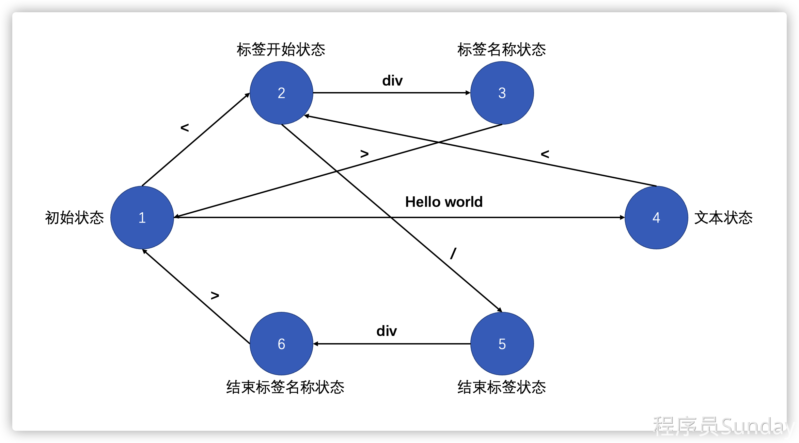

## JavaScript与有限自动状态机


我们知道想要实现 `compiler` 第一步是构建  `AST` 对象。那么想要构建 `AST`，就需要利用到 [有限状态机](https://zh.wikipedia.org/wiki/有限状态机) 的概念。

有限状态机也被叫做 **有限自动状态机**，表示：**有限个**[**状态**](https://zh.wikipedia.org/wiki/状态)**以及在这些状态之间的转移和动作等行为的**[**数学计算模型**](https://zh.wikipedia.org/wiki/计算模型_(数学))


光看概念，可能难以理解，那么下面我们来看一个具体的例子：

根据 `packages/compiler-core/src/compile.ts` 中的代码可知，`ast` 对象的生成是通过 `baseParse` 方法得到的。

而对于 `baseParse` 方法而言，接收一个 `template` 作为参数，返回一个 `ast` 对象。

即：**通过** `parse` **方法，解析** `template`**，得到** `ast` **对象。** 中间解析的过程，就需要使用到 **有限自动状态机。**


我们来如下模板 （`template`） ：


```html
<div>hello world</div>
```


`vue` 想要把该模板解析成 `AST`，那么就需要利用有限自动状态机对该模板进行分析，分析的过程中主要包含了三个特性：


摘自：http://www.ruanyifeng.com/blog/2013/09/finite-state_machine_for_javascript.html

 

1. 状态总数是有限的 

1. 1. 初始状态
   2. 标签开始状态
   3. 标签名称状态
   4. 文本状态
   5. 结束标签状态
   6. 结束标签名称状态
   7. ......

 

​	2.任一时刻，只处在一种状态之中

​	3.某种条件下，会从一种状态转变到另一种状态 

1. 1. 比如：从 `1` 到 `2` 意味着从初始状态切换到了标签开始状态

 


如下图所示：




1. 解析 `<`：由 **初始状态** 进入 **标签开始状态**
2. 解析 `div`：由  **标签开始状态** 进入 **标签名称状态**
3. 解析 `>`：由 **标签名称状态** 进入 **初始状态**
4. 解析 `hello world`：由  **初始状态** 进入 **文本状态**
5. 解析 `<`：由  **文本状态** 进入 **标签开始状态**
6. 解析 `/`：由 **标签开始状态** 进入 **结束标签状态**
7. 解析 `div`：由 **结束标签状态** 进入 **结束标签名称状态**
8. 解析 `>`：由  **结束标签名称状态** 进入 **初始状态**


经过这样一些列的解析，对于：


```html
<div>hello world</div>
```


而言，我们将得到三个 `token`：


```html
开始标签：<div>
文本节点：hello world
结束标签：</div>
```


而这样一个利用有限自动状态机的状态迁移，来获取 `tokens` 的过程，可以叫做：**对模板的标记化**。


**总结**

那么这一小节，我们了解了什么是有限自动状态机，也知道了它的三个特性。

`vue` 利用它来实现了对模板的标记化，得到了对应的 `token`。

那么这些 `token` 有什么用呢？我们下一小节再说。


## 扫描 tokens 构建 AST 结构

生成 `AST` 的过程，就是 `tokens` **扫描的过程**。


由以上代码可知：


1. 整个 `AST` 生成的核心就是 `parseChildren` 方法。
2. 生成的过程中，对整个 `template`：`<div> hello world </div>` 进行了解析，整个解析分为 `5` 步（第二小节的讲解）： 

1. 1. **第一次解析：**`<div`：此时 `context.source = >hello world</div>`
   2. **第二次解析：**`>`：此时 `context.source = hello world</div>`
   3. **第三次解析：**`hello world`：此时 `context.source = </div>`
   4. **第四次解析：**`</div`：此时 `context.source = >`
   5. **第五次解析：**`>`：此时 `context.source = ''`

   3.在这个解析过程中，我们逐步扫描（第三小节的讲解）对应的每次 `token`，得到了一个对应的 `AST` 对象


`vue` 源码中的 `parse` 逻辑是非常复杂的，我们当前只是针对 `<div>hello world</div>` 这一种类型的 `element` 类型进行了处理。

parse 主要作用是为了把template 转化成AST 抽象语法树


## AST 到 JavaScript AST的转化

transform 可以把AST转化成 JavaScript AST


## 生成 render 函数

generate 把JavaScript AST 转化成 render函数


## 总结

到这里我们就已经完成了一个基础的编辑器处理。

我们知道整个编辑器的处理过程分成了三部分：

1. 解析模板 `template` 为 `AST` 

1. 1. 在这一步过程中，我们使用了 

1. 1. 1. 有限自动状态机解析模板得到了 `tokens`
      2. 通过扫描 `tokens` 最终得到了 `AST`

  2.转化 `AST`  为 `JavaScript AST` 

1. 1. 这一步是为了最终生成 `render` 函数做准备
   2. 利用了深度优先的方式，进行了自下向上的逐层转化

  3.生成 `render` 函数 

1. 1. 这一步是最后的解析环节，我们需要对 `JavaScript AST` 进行处理，得到最终的 `render` 函数

整个一套编辑器的流程非常复杂，我们目前只完成了最基础的编辑逻辑，目前只能支持 `<div>文本</div>` 的处理。那么如果我们想要处理更复杂的逻辑，比如：

1. 响应性数据
2. 多个子节点
3. 指令

的话，对比编辑器而言，还需要做更多的事情才可以。

下一章，我们会深入编辑器，来看一下，以上问题应该如何进行处理。

